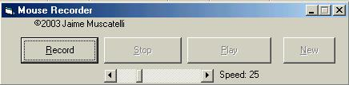



## \[\_\_\_\_A Great and Easy Mouse Position Recorder\]

### Description

This is a mouse recorder example. It records an unlimited amount of mouse moves and then replayes them! (See ScreenShot). Uses imtermediate loops, the vb Split() function, and the mouse API. Give it a try. KEYWORDS: Jaime jaime Muscatelli muscatelli api API Api Split split SPLIT mouse Mouse MOUSE recorder Recorder RECORDER Play play PLAY GetCursorPos SetCursorPos GetCursorPos() SetCursorPos() pointapi PointApi POINTAPI cursor CURSOR Cursor
 
### More Info
 

             |
---                |---
**Submitted On**   |2003-04-21 17:34:40
**By**             |[Jaime Muscatelli](https://github.com/Planet-Source-Code/PSCIndex/blob/master/ByAuthor/jaime-muscatelli.md)
**Level**          |Intermediate
**User Rating**    |4.8 (38 globes from 8 users)
**Compatibility**  |VB 6\.0
**Category**       |[Windows API Call/ Explanation](https://github.com/Planet-Source-Code/PSCIndex/blob/master/ByCategory/windows-api-call-explanation__1-39.md)
**World**          |[Visual Basic](https://github.com/Planet-Source-Code/PSCIndex/blob/master/ByWorld/visual-basic.md)
**Archive File**   |[\_\_A\_Great\_1577584212003\.zip](https://github.com/Planet-Source-Code/jaime-muscatelli-a-great-and-easy-mouse-position-recorder__1-44934/archive/master.zip)

